# Bienvenue sur mon Tuto Tanzu avec Azure

# Section 1 Préparation Poste de Travail

* ## Docker desktop : https://docs.docker.com/desktop/windows/install/

* ## Kubectl sur windows : https://kubernetes.io/docs/tasks/tools/install-kubectl-windows/

* ## Windows terminal : https://docs.microsoft.com/fr-fr/windows/terminal/install

* ## Compte Azure : https://azure.microsoft.com/fr-fr/free/

* ## Télécharger et Installer Tanzu Community Edition sur son poste: https://tanzucommunityedition.io/docs/latest/cli-installation/
    * ### Vous décompresser le ZIP
    * ### Ouvrez un powershell en administrateur et lancer le script install
     * ### Le script va vous installer la CLI Tanzu
     * ### Modifier la variable PATH système pour que la CLI Tanzu soit prise en compte

    <br>

     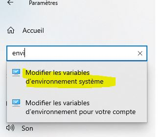

    <br>

     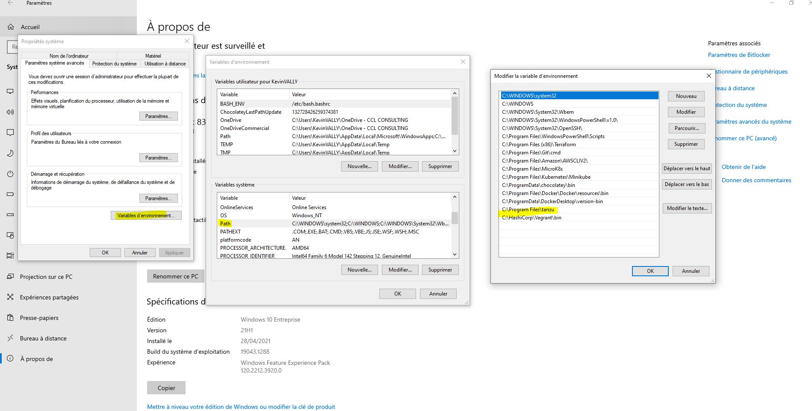


<br>

# Section 2 Préparation sur Azure

## Conseil : Sur le portail Azure utilisez au maximum la barre de recherche pour trouver les ressources. Exemples : Resource Group / APP Registration / Subscriptions

## Créer son RG 

<br>

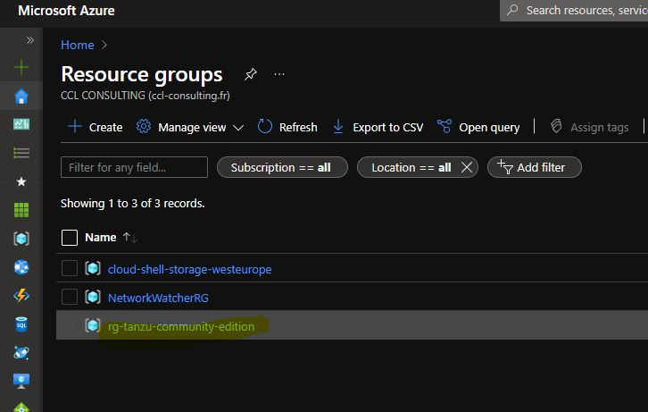

<br>

## APP Regsitration Tanzu et sauvegarder son secret

<br>

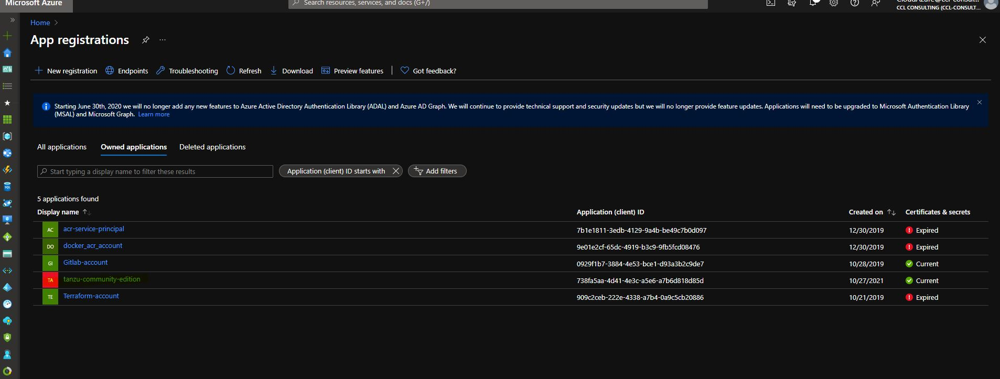

<br>

## Créer son secret pour son APP Registration
* # Attention sauvegarder votre secret car Azure ne l'affiche qu'une fois

<br>

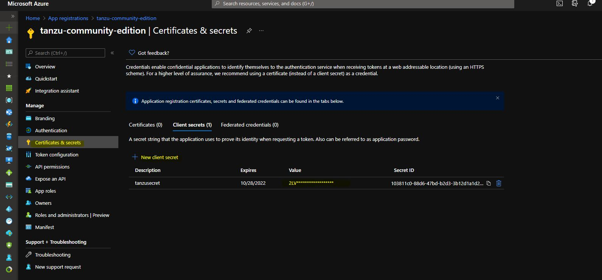

<br>

## Donner le bon rôle a son APP Registration sur sa subscription
* # Donner le rôle Owner a votre APP Registration

<br>

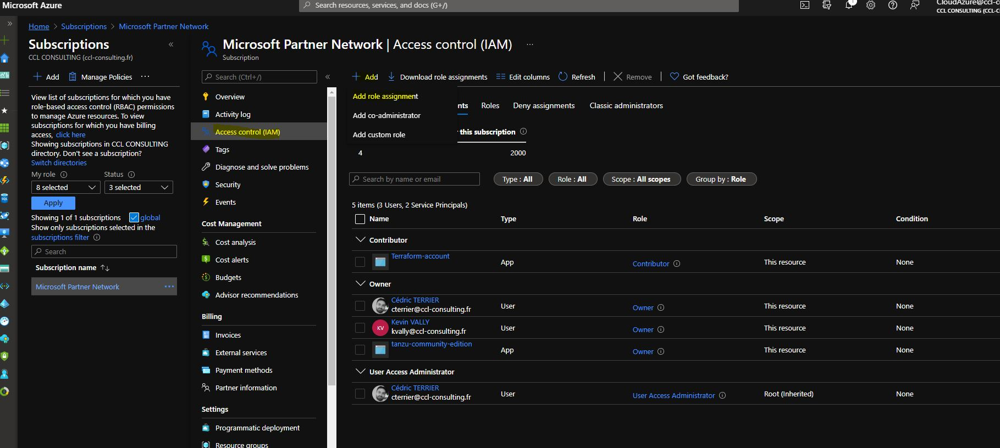

<br>

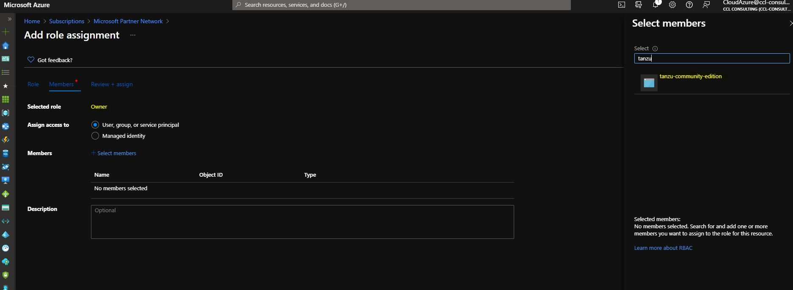

<br>

## Créer une clé SSH

<br>

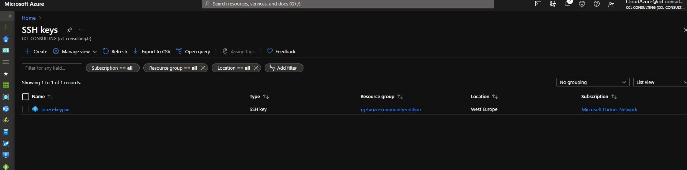

<br>

## Commande pour accepter le contrat d'utilisation sur le marketplace Azure : 

<br>

```
Get-AzureRmMarketplaceTerms -Publisher "vmware-inc" -Product "tkg-capi" -Name "k8s-1dot21dot2-ubuntu-2004" | Set-AzureRmMarketplaceTerms -Accept
```

<br>

# Si besoin voici la documentation VMWARE : https://docs.vmware.com/en/VMware-Tanzu-Kubernetes-Grid/1.2/vmware-tanzu-kubernetes-grid-12/GUID-mgmt-clusters-azure.html

<br>

# Section 3 Installation automatisé via l'interface web

<br>

```
tanzu management-cluster create --ui
```

<br>

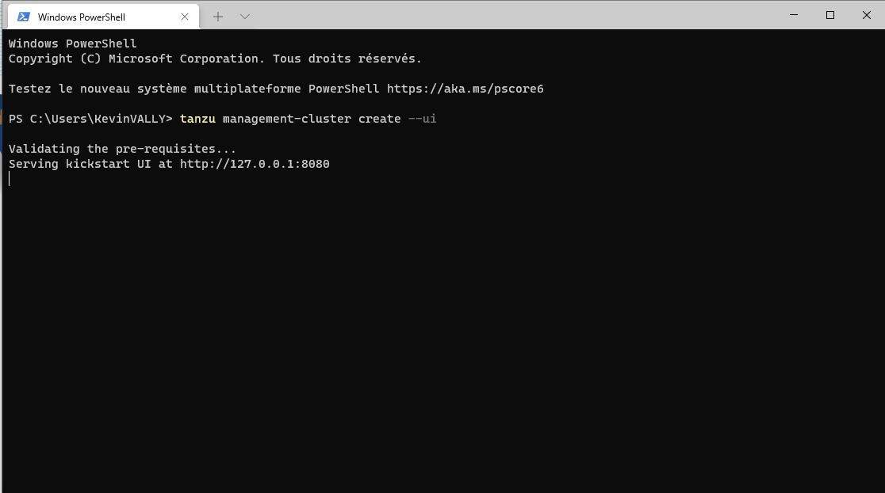

<br>

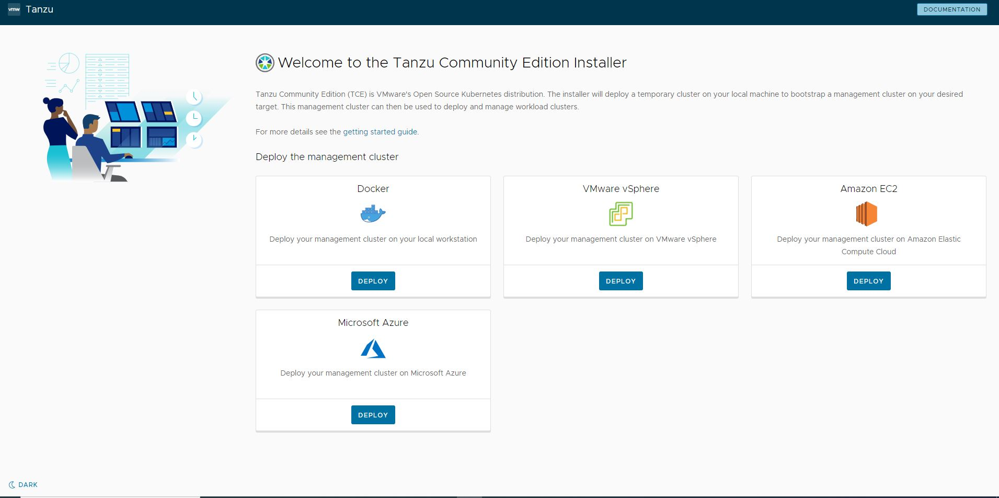

<br>

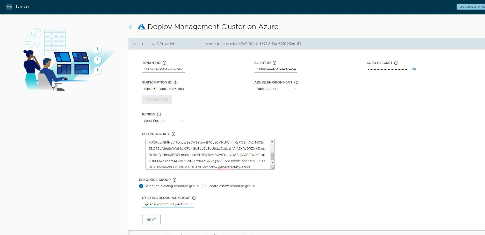

<br>

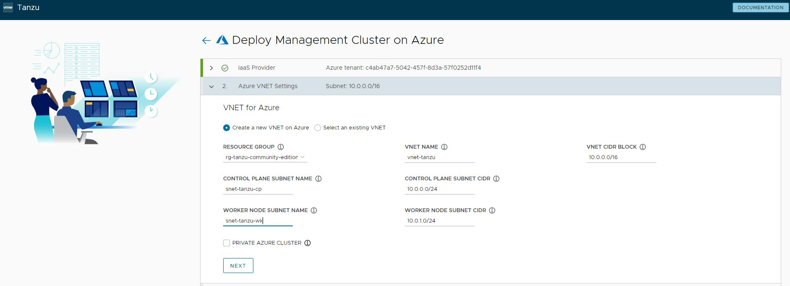

<br>

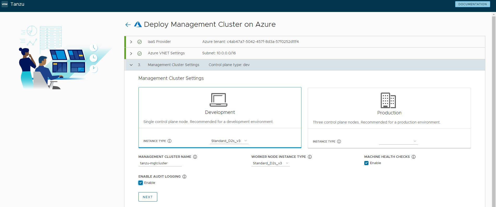

<br>

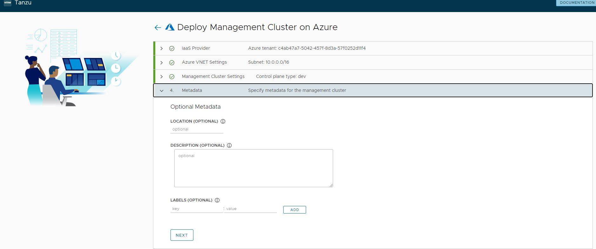

<br>

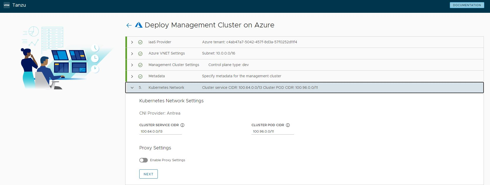

<br>

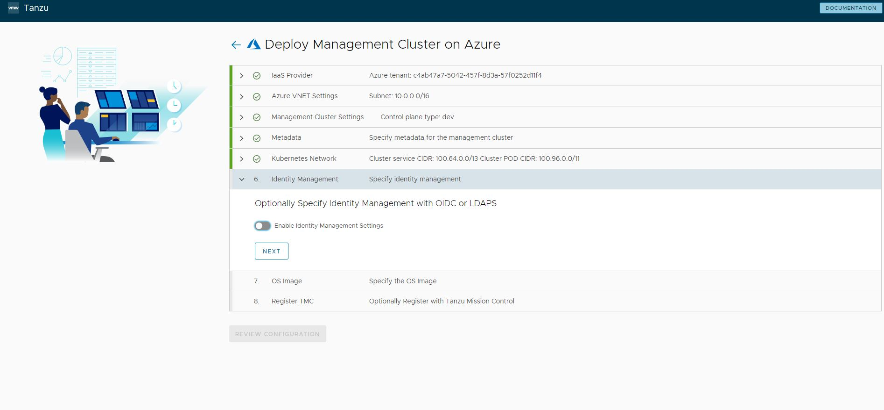

<br>

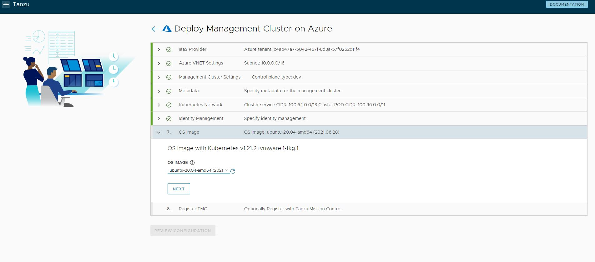

<br>


<br>

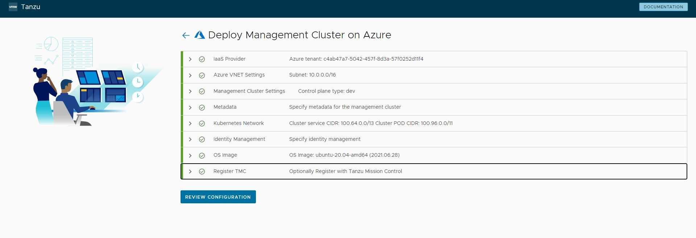

<br>

## Section 4 Connection au cluster Tanzu CE

<br>

```
tanzu management-cluster get
```

<br>

```
tanzu management-cluster kubeconfig get --admin
```

<br>

```
kubectl config use-context tanzu-mgtcluster-admin@tanzu-mgtcluster
```

<br>

```
kubectl get nodes
```

tanzu package repository add tce-repo --url projects.registry.vmware.com/tce/main:0.9.1 --namespace tanzu-package-repo-global